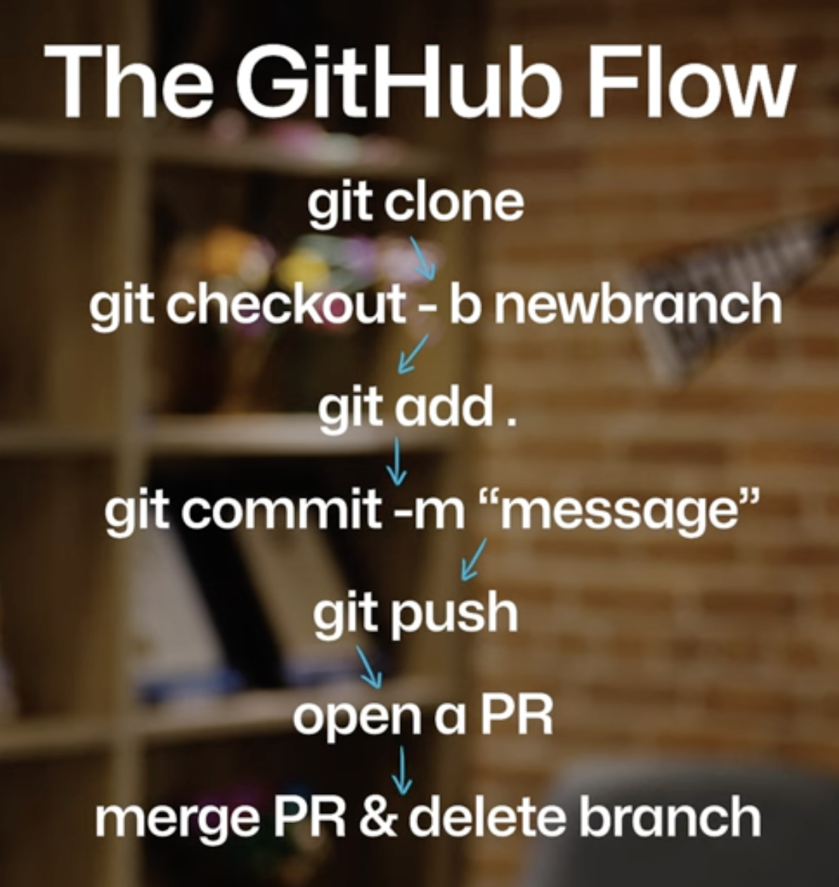

# git-practice
trying out basic git commands

git config --global user.name "<username_here>"

git config --global user.email "<email_here>"

## this one lists the config
git config list

## to track a changes to a project folder / turn on the git switch
git init

## to get the current status and see what has been done so far
git status

## this one is for setting alias

git-practice % git config --global alias.i init

git-practice % git config --global alias.s status

now you can use git i for git init & git s for git status

## to add any untracked file to staging area
git add <file_name>
or
git add . # to stage all untracked files 

## to save changes made to the staged file commit is used
git commit -m "initial commit" 

## to create a local copy of a remote repository(Https) 
git clone <repo_url.git>

## to switch to a new branch. If the branch doesnt exist it will create a new one.
git checkout -b branchname

## to see the list of branches 
git branch

## to switch main branche 
git switch main

## to push the changes to my branch (grandmaster)
git push origin grandmaster

## create a PR(pull request) for peer review from my branch (grandmaster)
on the UI

## once review is done merge changes tothe main branch
on the UI

## so by now the remote repository main branch is updated and is in sync with the dev branch (grandmaster) but the local copy of the main branch is still reflecting the old version. to sync that we switch the branch to main and pull the main branch again
git switch main
git pull

## git show > it gives details of the last merge on the main branch example
git show
commit 6d2476184761a72d8d8d4b9dafda9619235cfd9b (HEAD -> main, origin/main, origin/HEAD)
Merge: bf2191a ce6db52
Author: collabwithgrandmaster <collabwithgrandmaster@gmail.com>
Date:   Mon Dec 29 02:29:39 2025 +0530

    Merge pull request #3 from collabwithgrandmaster/grandmaster
    
    updated the readme

## the GitHub Flow

# Last step is to delete the dev branch

git branch -d grandmaster

git push --delete origin grandmaster

## important urls
https://github.blog/developer-skills/programming-languages-and-frameworks/what-is-git-our-beginners-guide-to-version-control/

https://github.blog/developer-skills/github/top-12-git-commands-every-developer-must-know/

https://choosealicense.com/ # for selecting right license for the git repo/project

https://www.toptal.com/developers/gitignore # for gitignore template files

https://learn.github.com/certifications # for github certifications.
